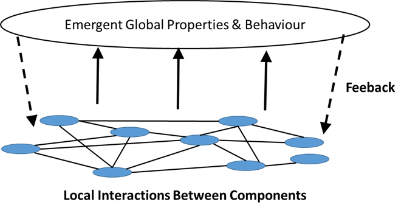
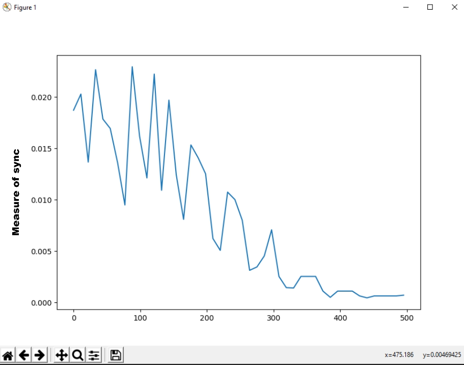

# Evolve_Swarm_Fireflies
<p align = "center">

</p>

## The core idea
A genetic algorithm which applies its selective pressure at the level of the group instead of at the level of the individual like commonly done. Selecting based on an emergent property.
<p align = "center">

</p>

## Proof of concept: evolve swarm of fireflies blinking in unison

<p align = "center">

</p>

<p align = "center">
  
<br>
  
<br>
  
</p>

### Context
Each swarm has 40 fireflies and each fireflie has 8 neighbors. Each firefly is a neural network that has 1 input neuron(taking the clock of the neighbor who blinked), two hidden layers of 16 nodes each and 1 output neuron(which gives the update to the internal clock of the firefly).

The **fitness/objective function** must measure the degree to which the fireflies are blinking in unison. This is done by looking at the standard deviation of the clocks after 500 iterations in the simulation. This score is attributed as the fitness value of that specific swarm.

<p align = "center">

</p>

### Proposed method
In order to find the right coefficients and biases for the fireflies to blink in unison, the proposed evolutionary algorithm process is similar to the common one, but it applies its selective pressure at a higher level of aggregation.
- Draw a pool of swarms, instead of a pool of individual fireflies. 
- Let each swarm live for 500 iterations and then measure how well each swarm managed to get its fireflies blinking in unison. This is the fitness function. 
- Then create the next generation by making the best swarms reproduce more. Add a small mutation rate.
- And Repeat(for about ~100 generations).

<p align = "center">

</p>

### Results
It works :) After 100-150 generations, the best fireflies are very well synchronized together. Diminishing returns kick in after around 80 generations. This evolutionary algorithm has evolved the local rules(which are the right coefficient and biases in our neural networks) in order for a swarm of firefly to converge to the same tempo, pulsating in near-unison. A common fitness value after 100 generations is <2e-4 seconds (cf. fitness function definition above)

<p align = "center">

</p>

### Details
- Written from scratch in Python and Numpy
- To evolve best swarm: ```python main.py```
- To animate best swarm: ```python Animate_best_swarm.py```

If you have any further questions, let me know MathisP_public@outlook.com :)

